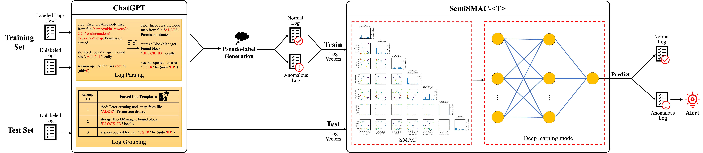

# `SemiSMAC-<T>`: Advancing Semi-supervised Anomaly Detection in Software Logs with Deep Grouping and Auto-Optimization

This paper proposes `SemiSMAC-<T>`, a novel semi-supervised anomaly detection model that leverages ChatGPT for log parsing and grouping, enhancing the efficiency and accuracy of log processing. It can also determine the optimal hyperparameter combinations for different datasets, thus achieving outstanding anomaly detection performance.

In detail, We follow a common workaround to exert ChatGPT for log parsing and then novely incorporate log grouping into it. The grouping process requires only a few labeled samples for ChatGPT to guide the assignment of pseudo-labels for the rest of the samples, thereby expanding training examples. Additionally, `SemiSMAC-<T>`, as a general DALD framework, adopts a random forest-based Bayesian Optimization Algorithm (BOA) to automatically tune the hyperparameters of embedded models. Consequently, efficiently and effectively improving the performance of DALD one-step further, even in low-resource scenarios.

## Datasets

- `SemiSMAC-<T>` and other benchmark models are implemented on [HDFS](https://github.com/logpai/loghub/tree/master/HDFS) and [BGL](https://github.com/logpai/loghub/tree/master/BGL) datasets

- Please note that due to the large size of the datasets, we have not included the original files in the GitHub repository. You can download the corresponding dataset files by clicking on the provided link.
